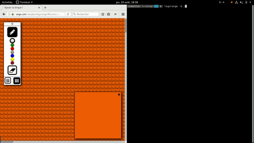

# Webcom C SDK



The **Webcom C SDK** allows the C developers to easily interact with a Webcom
server, such as the ones operated by the
[Orange Flexible Datasync](https://datasync.orange.com/) service.

It is licensed under the LGPL V2.1. We appreciate contributions!

The Webcom C SDK has been developed on and for linux systems, but it might also
work out of the box on other platforms, or require only little tweaks to do so.
If you run it on another platform, kindly let us know so that we can share the
information. If you made some modifications to make it work on your platform,
please consider opening a pull request so it gets integrated here.

## General design

This SDK is meant to be used in a event-loop, and does not provide its own
event loop. This means the SDK users are responsible for implementing the event
loop (we may provide one in the future). The general steps to follow are:

1. establish a connection to the Webcom server using `wc_cnx_new()`,
2. query the file descriptor for that connection using `wc_cnx_get_fd()`,
3. poll that file descriptor in your event loop for write events,
4. call `wc_cnx_on_readable()` whenever this event occurs; if there is any
   Webcom service-level event you should be aware of, this will automatically
   trigger the callback you passed to `wc_cnx_new()` with the relevant
   informations as parameters.

**Note:** The Webcom server **will close any inactive connection** after a 1
minute timeout. The event loop is responsible for calling `wc_cnx_keepalive()`
periodically (e.g. every 50 seconds) to keep the connection alive.

The above-described logic is implemented in the provided examples, using
**libev** as an event loop. A "boilerplate" project is also available in the
[examples/cmake-boilerplate-project/](examples/cmake-boilerplate-project/)
folder, feel free to copy and adapt it to your needs. It also shows how the SDK
can be conveninently used in a CMake project using:

```
find_package(webcom-c)
```

## Get the SDK

There are serveral ways of getting this SDK. The easiest one is to download a
precompiled package for your distribution. If we don't provide a package for
your distribution, you can build it from the sources, directly on your host, or
using a dedicated docker image.

### Install the pre-compiled package

Choose one package corresponding to your hardware/distribution from the
Github **releases** tab.

### Docker build images

Some Docker images have been crafted in [build-images/](build-images/), to build
the Webcom C SDK for several distributions. If you want to build your own
package of your own version of the SDK, using these images make it rather
straighforward.

#### Build the Docker image

Follow these steps:

```
$ cd build-images
$ docker image build -f Dockerfile.<DISTRIBUTION> . -t <TAG_NAME>
(replace DISTRIBUTION by an appropricate value, and TAG_NAME by what you want)
```

#### Build the Webcom C SDK by running the docker image

```
$ docker container run [<OPT ENV VARIABLES>] -v "$PWD:/tmp/webcom-package/" -ti <TAG_NAME>
```

After the build process, the container should exit and the binary package that
was produced should be located in the current working directory on the host.
You can modify the behaviour of the build by providing some environment
variables to the container:

Variable name | Meaning
--------------|--------
**`git_url`** | the git repository URL to clone the source code from
**`git_ref`** | the git revision (hash, branch, tag, ...) to build

**Example:**

```
$ docker image build -f Dockerfile.ubuntu16.10 . -t webcom-sdk-c-build-ubuntu16.10
(...)
$ docker container run \
	-e git_url="git@github.com:johndoe/webcom-sdk-c.git" \
	-e git_ref="my_branch" \
	-v "$PWD:/tmp/webcom-package/" \
	-ti webcom-sdk-c-build-ubuntu16.10
```

### Build manually from Git

#### Build prerequisites

(**Note:** you can also take a look the Dockerfiles in
[build-images/](build-images/) to get an idea of the requirements)

##### On a debian-family platform (Debian >= 9, Ubuntu >= 16.04)

```
# apt-get install cmake gcc cmake make pkg-config libjson-c-dev libwebsockets-dev libev-dev libncurses5-dev doxygen
```

##### On a RedHat-family platform (CentOS or RHEL >= 7, Fedora Core >= 24)

for CentOS 7 and RHEL 7

```
# yum install epel-release
# yum install cmake3

```

for fedora core >= 24

```
# yum install cmake
```

then

```
# yum install gcc make pkgconfig json-c-devel libwebsockets-devel openssl-devel libev-devel ncurses-devel doxygen
```

#### Build process

```
$ git clone [this repo URL]
(...)
$ cd webcom-sdk-c/build
$ cmake ..
(use `cmake3` instead of cmake) under CentOS 7 and RHEL 7)
(...)
$ make all
(...)
```
It will produce **libwebcom-c.so** in the **lib/** subdirectory, plus the
examples, documentation, and the test programs.

#### Install

```
[still in the build/ folder]
$ sudo make install
```

## Documentation

The documentation is produced by doxygen (the public .h files contain the
documentation). The binary packages and manual installation do install the
**webcom-connection**, **webcom-event**, **webcom-general**,
**webcom-messages**, **webcom-parser**, **webcom-requests**, **webcom-utils**
man pages, that document the SDK API. You can also generate the documentation
in HTML format (requires graphviz):

```
[still in the build/ folder]
$ cmake .. -DBUILD_HTML_DOCUMENTATION=ON
$ make doc
(builds the HTML doc in doc/html/)
```

## Demos

This SDK comes with two examples: **legorange** and **wcchat** in the
[examples/](examples/) directory. They are the C counterparts of
[Legorange](https://io.datasync.orange.com/samples/legorange/) and
[WebCom Simple Chat](https://io.datasync.orange.com/samples/chat/). These demos
are automatically built and installed along with the SDK, and their source code
are meant to be a source of information and inspiration on how to start hacking
with the SDK.

